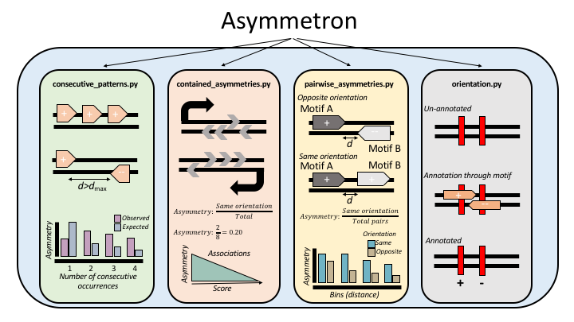

===========
# Asymmetron
===========

## Installation

1.- Clone github repository

	git clone https://github.com/Ahituv-lab/Asymmetron

2.- Create a conda virtual enviroment with the necesary dependencies 

	conda create --name asymmetron pybedtools python=3.5 seaborn numpy

3.- Activate virtual enviroment
	
	conda activate asymmetron

## Introduction
DNA strand specificity can have a major effect on numerous biological functions, including DNA replication, mRNA transcription and transcription factor binding. The directionality of these processes results in the inhomogeneous distribution of genomic sequences relative to the two complementary DNA strands. By studying systematically strand asymmetries we can identify novel DNA elements, improve our comprehension regarding their interactions with one another and advance our understanding regarding the contribution of underlying processes in mutagenesis and evolution. To date, there is no versatile tool to perform analysis of strand asymmetries across biological problems. 

## Quick Summary 
Asymmetron is a toolkit for the identifcation of asymmetry patterns in biological sequences. Asymmetron can identify strand asymmetries within consecutive occurrences of a single genomic element and for pairs of overlapping and non-overlapping genomic elements. It can also measure strand asymmetries of genomic elements relative to transcriptional and replicative orientations. Asymmetron can assign strand orientation to third features such as mutations, by orienting them relative to other genomic elements. 

## Documentation

An in depth documentation, including a tutorial with examples can be found at:
https://asymmetron.readthedocs.io/en/latest/index.html

## Asymmetron is licensed under the Apache 2.0 License.

## For questions, ideas, feature requests and potential bug reports please contact ilias.georgakopoulossoares@ucsf.edu 
