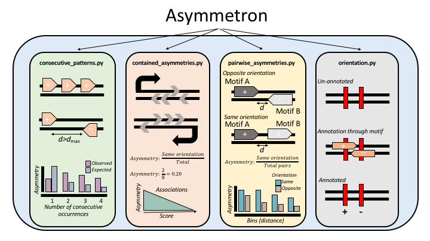

.. quick_summary

=============
Quick-Summary
=============

| 

Asymmetron is a toolkit for the identifcation of asymmetry patterns in biological sequences. It provides support for four types of analyses: 

**i)   consecutive strand asymmetry estimation in a single file with strand annotation.**

**ii)  strand asymmetry estimation of strand-assigned nucleotide-sequence motifs within strand-assigned regions.**

**iii) strand asymmetry estimation between two strand-assigned motifs in proximity or overlapping each other.**

**iv)  strand assignment of an unassigned feature based on another overlapping feature, thereby enabling the strand asymmetry analysis of the first.**

