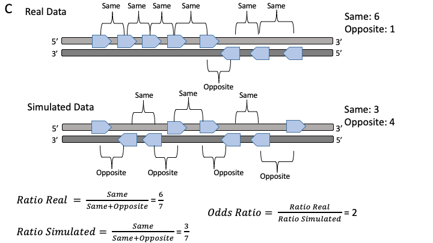
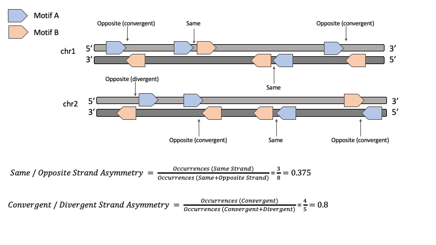

.. tutorial
 
========
Tutorial
========

| 

**Strand asymmetry analyses with Asymmetron.**
---------------------------------------------------------------

Below we provide:

* Explanation of the utility and applications of each function.

* Explanation of the estimation of strand asymmetries and ther interpretation.

* Examples of implementing each function in different settings and biological problems.

|

Important information across Asymmetron functions:

* All input files for Asymmetron should be in BED format.

* All outputs are saved in the folder Asymmetron_output with a timestamp of when they were created.

* All functions can be run for single files or for sets of files that are comma separated.

|

**1. Calculation of consecutive strand asymmetries for a non-palindromic motif.**
---------------------------------------------------------------------------------

This function enables the identification of biases in orientation patterns within the distance limits for a single file.
The distance limits correspond to the mininum and maximum distances of consecutive features to consider.
The patterns correspond to any set of "+" and "-" signs e.g. "+-" or "++ etc. By default the same / opposite strand asymmetry of consecutive occurrences is calculated.

|

By shuffling the strand annotations in the file we create a null distribution which accounts for potential biases in the number of "+" and "-" and biases in the distances of consecutive occurrences of the feature. 
Next, we estimate the expected number of N consecutive occurrences of the pattern of interest.
We compare the expected number of N consecutive occurrences of the pattern of interest to the observed occurrences in the file.
For the same / opposite comparison, statistical significance for same versus opposite orientation preference for consecutive occurrences is estimated with Fisher's Exact test between the real and the simulated data.

|

**Potential biological questions:**

* How many times do you find three or more occurrences of motif A in the real versus in the simulated data.

* Is the convergent orientation (+ followed by -) more frequent than expected by chance in your dataset?

* Are homotypic transcription factor motif occurrences displaying strand bias?

* Are genes found in clusters and do they have specific orientation biases?

|

**Examples:**

I. CTCF motif orientation preference of consecutive motifs within 100bp from each other.

|

.. code-block::

   wget http://expdata.cmmt.ubc.ca/JASPAR/downloads/UCSC_tracks/2018/hg19/tsv/MA0139.1.tsv.gz

   gunzip MA0139.1.tsv.gz

   cat MA0139.1.tsv | awk '{print $1 "\t" $2 "\t" $3 "\t" $4 "\t" $5 "\t" $7}'| sed 1d > MA0139.1.bed 

Estimate the orientation bias of homotypic occurrences of the CTCF motif:

.. code-block::
   
   python consecutive_patterns.py MA0139.1.bed –max_distance=100 

|

II. Estimate the orientation bias of consecutive miRNA genes.

Download and extract the miRNA genes from gencode annotation:

.. code-block::

   wget ftp://ftp.ebi.ac.uk/pub/databases/gencode/Gencode_human/release_33/gencode.v33.annotation.gtf.gz

   gunzip gencode.v33.annotation.gtf.gz

   cat gencode.v33.annotation.gtf | grep 'gene_type "miRNA"'  | awk '$3 == "gene" {print $1 "\t" $4 "\t" $5 "\t" $3 "\t" "." "\t" $7}' > miRNA_genes.bed

Measure the orientation bias of consecutive miRNA genes within 10kB from each other using Asymmetron:

.. code-block::

   python consecutive_patterns.py miRNA_genes.bed --max_distance=10000 

This type of analysis will print the odds ratio and p-value, in this case miRNA genes tend to be in the same orientation (Odds Ratio > 1, Fisher Exact Test: p-value=6.342e-14):

.. code-block:

   Odds Ratio:3.4322072413270717 p-value:6.342108235123232e-14

The outputs also include the number of consecutive occurrences of miRNA genes and BED-formatted files of the statistically significant consecutive occurrences.

|

**2. Calculation of non-palindromic motif strand asymmetries within a region with directionality (e.g. a gene).**
------------------------------------------------------------------------------------------------------------------

|

Regions refer to genomic features such as genes, endogeneous repeat elements, replication deciles etc.

This function enables the estimation of strand asymmetries in the distribution of motifs in the region files.

A strand asymmetry ratio of 0.5 would reflect equal number of occurrences in the template and non-template strands.
A strand asymmetry ratio of 0 would reflect complete orientation preference towards the template strand
A strand asymmetry ratio of 1 would reflect complete orientation preference towards the non-template strand.

The accompanying p-value is estimated by binomial testing and is adjusted for multiple testing if multiply queries are made in a single command.

|

**Potential biological questions:**

* Is there nucleotide composition asymmetry in an organism of interest?

* Are motifs of interest more likely to be found in the template or non-template strands?

* Do endogeneous repeat elements display transcriptional or replicative strand asymmetries?

* Do specific mutation types show transcriptional or replicative strand asymmetries?

* Are transcription factor binding sites biased in their orientation relative to the transcriptional direction?

* Are the motifs of RNA-binding proteins found more frequently at the non-template strand near splice sites?

|

**Examples**

I. Find Alu repeat element transcriptional strand asymmetries across genic regions.

| 

Download Alu repeats:

.. code-block::

   wget http://hgdownload.cse.ucsc.edu/goldenpath/hg38/database/rmsk.txt.gz

   cat rmsk.txt | grep  -E 'SINE' | awk '{print $6 "\t" $7 "\t" $8 "\t" $11 "\t" "." "\t"  $10 "\t" $12 "\t" $13}' > SINEs.bed

   cat SINEs.bed  | awk '$8=="Alu" {print $0}' > Alu.bed

| 

Download and format GENCODE gene annotation:

.. code-block::

   wget ftp://ftp.ebi.ac.uk/pub/databases/gencode/Gencode_human/release_33/gencode.v33.annotation.gtf.gz

   gunzip gencode.v33.annotation.gtf.gz

   cat gencode.v33.annotation.gtf | grep 'gene_type "protein_coding"'  | awk '$3 == "gene" {print $1 "\t" $4 "\t" $5 "\t" $3 "\t" "." "\t" $7}' > gencode.v33.annotation.bed.protein_coding

|

Calculate the transcriptional strand asymmetry of Alu repeats in genic regions:

.. code-block::

   python contained_asymmetries.py gencode.v33.annotation.bed.protein_coding Alu.bed

|

II. Find if polyadenylation signals are more likely to be in the template or non-template orientation.

|

Download and format the dataset:

.. code-block::

   wget https://polyasite.unibas.ch/download/atlas/2.0/GRCh38.96/atlas.clusters.2.0.GRCh38.96.bed.gz

   gunzip atlas.clusters.2.0.GRCh38.96.bed.gz

   # format the dataset
   cat atlas.clusters.2.0.GRCh38.96.bed | awk '{print "chr" $1 "\t" $2 "\t" $3 "\t" $4 "\t" $5 "\t"  $6 "\t" $12}' > atlas.clusters.2.0.GRCh38.96.bed.formatted
   
Download and format the GENCODE gene annotation:

.. code-block::

   wget ftp://ftp.ebi.ac.uk/pub/databases/gencode/Gencode_human/release_33/gencode.v33.annotation.gtf.gz

   gunzip gencode.v33.annotation.gtf.gz

   cat gencode.v33.annotation.gtf | grep 'gene_type "protein_coding"'  | awk '$3 == "gene" {print $1 "\t" $4 "\t" $5 "\t" $3 "\t" "." "\t" $7}' > gencode.v33.annotation.bed.protein_coding

Calculate the transcriptional strand asymmetry of polyadenylation signals genic regions:

.. code-block::

   python contained_asymmetries.py gencode.v33.annotation.bed.protein_coding atlas.clusters.2.0.GRCh38.96.bed.formatted

As expected, we find a clear strand asymmetry towards the non-template strand with a ratio of 0.72 and p-value = 2e-323.

|

**3. Calculation of strand asymmetries between two non-palindromic motifs A and B:**
------------------------------------------------------------------------------------

Two motifs can be in: 

* same strand orientation (A) 

* opposite strand orientation (B).

|

If they are in opposite strand orientation they can be sub-divided into:

* convergent orientation (facing towards each other)

* divergent orientation (facing away from each other)

|

|

In the above example we provide a simple example to illustrate how we calculate the strand asymmetries for same / opposite orientation preference and convergent / divergent orientation preference.

|

**Potential biological questions:**

* Do transcription factor motif pairs display orientation preferences relative to each other?

* Do endogenoues repeat elements show orientation preferences relative to each other?

|

**Examples**

I. Strand asymmetry analysis between conserved motifs of SP1 and YY1 for distances of 1-200bp apart

|

Download the transcription factor binding site maps:

.. code-block::

   wget http://hgdownload.cse.ucsc.edu/goldenpath/hg19/database/tfbsConsSites.txt.gz 
   
   gunzip tfbsConsSites.txt.gz

Extract the two motifs of interest SP1 and YY1

.. code-block::

   cat tfbsConsSites.txt  | grep SP1 | awk '{print $2 "\t" $3 "\t" $4 "\t" $5 "\t" $6 "\t" $7}' > SP1_tfbsConsSites.bed

   cat tfbsConsSites.txt  | grep YY1 | awk '{print $2 "\t" $3 "\t" $4 "\t" $5 "\t" $6 "\t" $7}' > YY1_tfbsConsSites.bed

Run Asymmetron to find their pairwise strand asymmetries (same / opposite and divergent / convergent orientations):

.. code-block::

   python pairwise_asymmetries.py SP1_tfbsConsSites.bed YY1_tfbsConsSites.bed --min_distance=1 --max_distance=200

|

II. Strand asymmetry analysis between Alu and L1 repeats within 5kB from each other.

|

Download Alu and L1 repeats:

.. code-block::

   wget http://hgdownload.cse.ucsc.edu/goldenpath/hg38/database/rmsk.txt.gz 

   cat rmsk.txt | grep  -E 'SINE' | awk '{print $6 "\t" $7 "\t" $8 "\t" $11 "\t" "." "\t"  $10 "\t" $12 "\t" $13}' | awk '$8=="Alu" {print $0}' >  Alu.bed

   cat rmsk.txt | grep  -E 'LINE' | awk '{print $6 "\t" $7 "\t" $8 "\t" $11 "\t" "." "\t"  $10 "\t" $12 "\t" $13}' | awk '$8=="L1" {print $0}' > L1.bed

Find their pairwise orientation preferences with Asymmetron:

.. code-block::

   python pairwise_asymmetries.py Alu.bed L1.bed --max_distance=5000

|

**4. Assignment of strand orientation to un-assigned file.**
------------------------------------------------------------

The orientation.py function enables the strand annotation of one or more files using as criterion the sign value of an overlapping motif. The function returns the coordinates of the original file overlapping the motif file, with an additional column providing the strand orientation derived from the motif file. 

The output is one or more BED files with strand annotation assigned to each line.

|

**Examples:**

I. Assignment of orientation to CTCF ChiP-seq peaks.

|

Download CTCF motif map (hg19):

.. code-block::

   wget http://expdata.cmmt.ubc.ca/JASPAR/downloads/UCSC_tracks/2018/hg19/tsv/MA0139.1.tsv.gz

   gunzip MA0139.1.tsv.gz

   cat MA0139.1.tsv | awk '{print $1 "\t" $2 "\t" $3 "\t" $4 "\t" $5 "\t" $7}'| sed 1d > MA0139.1.bed 

Download CTCF ChiP-seq experiment (hg19):

.. code-block::

   wget http://hgdownload.soe.ucsc.edu/goldenPath/hg19/encodeDCC/wgEncodeSydhTfbs/wgEncodeSydhTfbsImr90CtcfbIggrabPk.narrowPeak.gz

   gunzip wgEncodeSydhTfbsImr90CtcfbIggrabPk.narrowPeak.gz

Assign strand orientation to ChiP-seq file:

.. code-block::

   python orientation.py wgEncodeSydhTfbsImr90CtcfbIggrabPk.narrowPeak MA0139.1.bed 

|

II. Assign strand orientation to structural breakpoint variants relative to Alu repeats:

|

Download and extract Alu repeats:

.. code-block::

   wget http://hgdownload.cse.ucsc.edu/goldenpath/hg38/database/rmsk.txt.gz

   # LINE, SINE and LTR repeats were extracted using the following command:

   cat rmsk.txt | grep  -E 'LINE|SINE|LTR' | awk '{print $6 "\t" $7 "\t" $8 "\t" $11 "\t" "." "\t"  $10 "\t" $12 "\t" $13}' > rmsk.txt.formatted

   cat rmsk.txt.formmatted | grep SINE > SINEs.bed
   
   cat SINEs.bed  | awk '$8=="Alu" {print $0}' > Alu.bed

Download and extract structural variants for the human population:

.. code-block::

   wget https://storage.googleapis.com/gnomad-public/papers/2019-sv/gnomad_v2.1_sv.sites.bed.gz

   gunzip gnomad_v2.1_sv.sites.bed.gz

   cat gnomad_v2.1_sv.sites.bed |  awk '{print "chr"$1 "\t" $2 "\t" $2 "\t" $5}' >> gnomad_v2.1_sv.sites.bed.formatted

   cat gnomad_v2.1_sv.sites.bed |  awk '{print "chr"$1 "\t" $3 "\t" $3 "\t" $5}' >> gnomad_v2.1_sv.sites.bed.formatted

Assignment of strand orientation to structural breakpoints using Alu repeats (this can later be used to investigate transcriptional and replicative strand asymmetries):

.. code-block::
  
   python orientation.py gnomad_v2.1_sv.sites.bed.formatted Alu.bed

|

---------------------
**Asymmetron help**

Each command includes a help option that lists all the available options that the command can run with.

.. code-block::

   python consecutive_patterns.py -h

   python contained_asymmetries.py -h

   python pairwise_asymmetries.py -h

   python orientation.py -h

