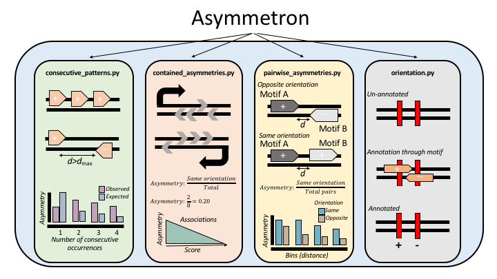

===========
# Asymmetron
===========

Copyright 2020. All rights reserved.

## Installation

conda create --name asymmetron pybedtools python=3.5 seaborn

## Introduction
DNA strand specificity can have a major effect on numerous biological functions, including DNA replication, mRNA transcription and transcription factor binding. The directionality of these processes results in the inhomogeneous distribution of genomic sequences relative to the two complementary DNA strands. By studying systematically strand asymmetries we can identify novel DNA elements, improve our comprehension regarding their interactions with one another and advance our understanding regarding the contribution of underlying processes in mutagenesis and evolution. To date, there is no versatile tool to perform analysis of strand asymmetries across biological problems. 

## Summary 
Asymmetron is a toolkit for the identifcation of asymmetry patterns in biological sequences. Asymmetron can identify strand asymmetries within consecutive occurrences of a single genomic element and for pairs of overlapping and non-overlapping genomic elements. It can also measure strand asymmetries of genomic elements relative to transcriptional and replicative orientations. Asymmetron can assign strand orientation to third features such as mutations, by orienting them relative to other genomic elements. 

It encompasses four functions:
1.	consecutive_patterns.py:	Estimates the asymmetry biases within consecutive occurrences of a single motif.
2.	contained_asymmetries.py	Estimates the asymmetry biases of a motif within an encompassing region.	
3.	pairwise_asymmetries.py		Estimates the asymmetry biases between two motifs.
4.	orientation.py			Orients an un-annotated BED file relative to overlapping instances of a second, annotated BED file.

## Instructions for each function

### 1. consecutive_patterns.py
#### Required input:
	paths: One or more BED-formatted files
#### Optional inputs:
	--names: Assign a name for each of the inputted BED-formatted files to allow for more human readable output
	--min_distance: Minimum distance between consecutive occurrences to consider in the analysis. Default is 0.
	--max_distance: Maximum distance between consecutive occurrences to consider in the analysis. Default is 100.
	--patterns: Patterns to search, comma separated. Default is ++,--,+-,-+.
	--orientation: Orient file(s) relative to annotated BED-formated file(s) and perform the analysis for the un-annotated file with the new annotations.
	--bins: Number of bins to subdivide the analysis in. Default is 1, which does not perform this analysis.
	--threshold: Threshold of p-value of consecutive patterns to save in new BED file.
    --plots: Returns the associated plots of the asymmetries for each file.
#### Outputs:
        -Table of strand asymmetries for all patterns for each motif.
        -BED files with the statistically significant consecutive regions. One file for each pattern for each file inputted.
        -Barplots of expected and observed consecutive occurrences of each of the patterns.
        -Plots showing the distribution of consecutive occurrences for each pattern.
        -Heatmap of subdivisions of the signal in distances across all patterns if --bins is selected

### 2. contained_asymmetries.py
#### Required inputs:
	regions: One or more BED-formatted files, containing the regions within which to estimate motif asymmetries.
	motifs: One or more BED-formatted files, for each of which the asymmetries are calculated.
#### Optional inputs:
	--names_regions: Assign a name for each of the BED-formatted region files to allow for more human readable output.
	--names_motifs: Assign a name for each of the BED-formatted motif files to allow for more human readable output.
	--orientation_region: Orient file(s) relative to annotated BED-formated region file(s) and perform the analysis for the un-annoated file with the new annotations.
	--orientation_motif: Orient file(s) relative to annotated BED-formated motif file(s) and perform the analysis for the un-annoated file with the new annotations.
	--expected_asym: The expected asymmetry bias between the regions and the motifs regarding same or opposite strand orientation. Default is 0.5.
	--expected_asym_conv_div: The expected convergent / divergent asymmetry bias between the regions and the motifs. Default is 0.5.
	--score: Optional flag. If provided, assumes the last column of the region files is a scoring metric and uses it to subdivide the analysis into bins.
	--bins_score: Number of bins to subdivide the score column into. Only runs when --score is provided. Default value is 10.
	--plots: Returns the associated plots of the asymmetries for each file.
#### Outputs:
	-Table containing strand asymmetries of ++/+-/-+/-- orientations, same-strand, opposite strand, p-value, p-value with Bonferoni correction.
	-Barplot of strand asymmetries for each pair of comparisons.
	-Barplot of strand-asymmetries across the score quantiles.
	-Table of strand asymmetries for same / opposite and convergent / divergent asymmetries per bin, associated p-vaues and p-values Bonferoni correction.

### 3. pairwise_asymmetries.py
#### Required inputs:
	motifsA: One or more BED-formatted files
	motifsB: One or more BED-formatted files
#### Optional inputs:
	--names_A: The name of each of the inputted BED-formatted motif A files.
	--names_B: The name of each of the inputted BED-formatted motif B files.
	--upstream_only: Only look for occurrences of motif A upstream of motif B. Incompattible with -downstream.
	--downstream_only: Only look for occurrences of motif A downstream of motif B. Incompatible with -upstream.
	--orientation: Orient file(s) relative to annotated BED-formated motif file(s) and perform the analysis for the un-annoated file with the new annotations.
	--expected_asym: The expected asymmetry bias between the pairs of motifs regarding same or opposite strand orientation. Default is 0.5.
	--expected_asym_conv_div: The expected convergent / divergent asymmetry bias between the pairs of motifs. Default is 0.5.
	--min_distance: Minimum distance to consider in the analysis. Default is 0.
	--max_distance: Maximum distance to consider in the analysis. Default is 100.
	--bins: Number of bins to subdivide the analysis in. Default is 1, which does not perform this analysis.
	--plots: Returns the associated plots of the asymmetries for each file.
#### Outputs:
	-Table containing strand asymmetries of ++/+-/-+/-- orientations, same-strand, opposite strand, p-value, p-value with Binomial correction (corrected for multiple file queries). 
	-Barplots of strand asymmetries for each pair of comparisons for same versus opposite and convergent versus divergent strand orientations.
	-Barplot of strand-asymmetries across the bins for same versus opposite and convergent versus divergent strand orientations.

### 4. orientation.py 	
#### Input requirements:
	-motif_no_annotation
	-motif_annotation
#### Output:
	-Un-annotated BED formatted motif with annotation based on -motif_annotation file.
